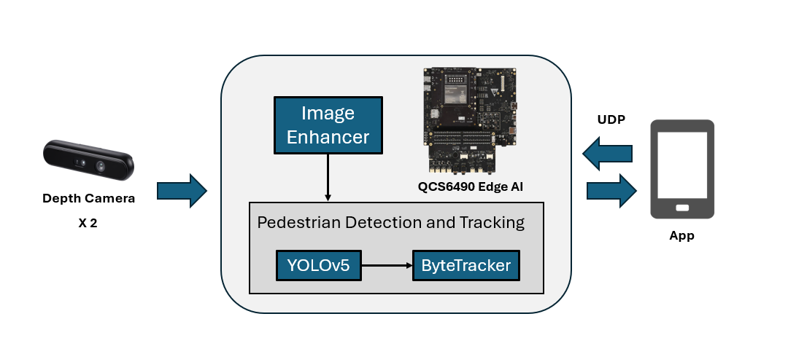

# Qualcomm QCS6490 turn Assist System

## Advantages of QCS6490

1. QCS6490 can provide up to 12 TOPS of AI computing power and supports GPU and DSP accelerated computing
2. The Qualcomm Neural Processing (SNPE) SDK and the Qualcomm AI Engine Direct (QNN) can optimize the performance of trained neural networks
3. It supports Yocto, Ubuntu, Android, and Windows for AI development

## Performance Metrics

- **AI Model**: YOLOv5s
- **System Performance**: 27 ~ 30 FPS

## Hardware

- **Platform**: [Qualcomm QCS6490](https://www.qualcomm.com/internet-of-things/products/q6-series/qcs6490)
- **Depth Camera**: Orbbec Gemini-336L * 2

## Software & Toolkit

- **AI SDK (SNPE):** v2.16.0.231029
- **Middleware (ROS 2):** ROS 2 Foxy

## Background & Solution

### Motivation

- pillar blind spots increase pedestrian collision risks during turns
- Low visibility conditions impair pedestrian detection at night

### Solution

- Dual-camera system with enhancement algorithms for A-pillar visibility
- Real-time detection system alerts drivers of nearby pedestrians

## Architecture Diagram

The system detects pedestrians through a depth camera, processes image enhancement, and runs pedestrian detection models and tracking algorithms. It analyzes vehicle dynamics and pedestrian distances, transmitting results to an app via UDP.

It issues visual and audio alerts to warn users based on different risk levels.

## Demo
https://github.com/user-attachments/assets/c60baba9-6a29-4c27-882b-00358ec26f4f

